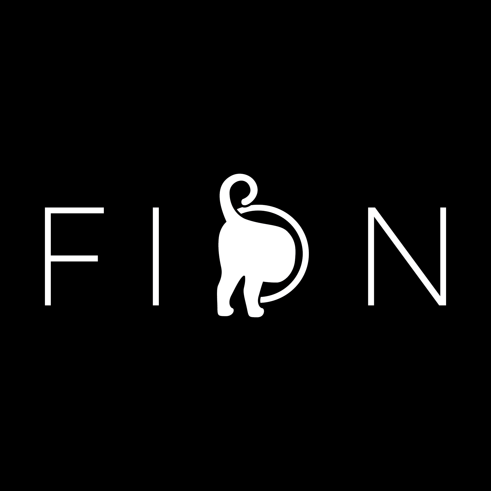

# fion

fion is a static tiling window manager for X11, inspired by
[ion](https://tuomov.iki.fi/software/ion/), written in Go on top of
[xgb](https://github.com/jezek/xgb).

**This is a work in progress: it runs, but it is not usable as a daily
window manager yet.**

design
--
Each X screen holds one or more workspaces, and always shows one of them.
A workspace is a tree of frames: it starts as a single frame filling it,
and any frame can be split in two, stacked or side by side.
Leaf frames hold X clients as tabs, listed in the frame's title bar.

A bar at the bottom of each workspace shows the screen and workspace
numbers, CPU and memory usage and the time.

building
--
fion needs Go 1.25 or later:

    $ go build ./cmd/fion

key bindings
--
Bindings use a prefix: press `Super+w` or `Super+f`, release, then press the
action key without any modifier.

| keys                 | action                                              |
|----------------------|-----------------------------------------------------|
| `Super+w` `c`        | create a workspace                                  |
| `Super+w` `n` / `p`  | next / previous workspace                           |
| `Super+w` `h`        | split the active frame top / bottom                 |
| `Super+w` `v`        | split the active frame left / right                 |
| `Super+w` `d`        | close the active client; in an empty frame, remove the frame; in the last empty frame, remove the workspace |
| `Super+f` `n` / `p`  | next / previous frame                               |
| `F2`                 | start an xterm                                      |
| `Super+Escape`       | quit fion                                           |

Set `FION_MODIFIER` to `ctrl`, `alt` or `mod1` to `mod5` to use another
modifier than Super.

running it nested
--
The easiest way to try fion is inside Xephyr:

    $ Xephyr :1 -screen 1280x800 &
    $ DISPLAY=:1 ./fion &
    $ DISPLAY=:1 xterm &

On macOS, with XQuartz, Xephyr can't create its socket in `/tmp/.X11-unix`
without root, and XQuartz has no Super key, so listen on TCP and use Ctrl:

    $ Xephyr :1 -screen 1280x800 -nolisten unix -nolisten local -listen tcp -ac &
    $ DISPLAY=127.0.0.1:1 FION_MODIFIER=ctrl ./fion

tests
--
The frame tree tests need an X server fion can manage, such as Xvfb, named
by `FION_TEST_DISPLAY`; they are skipped otherwise:

    $ Xvfb :99 -noreset &
    $ FION_TEST_DISPLAY=:99 go test ./wm

known limitations
--
- `F2` is not grabbed, so that applications keep it: it only starts an
  xterm when the pointer is not over a client
- input focus is not managed, it follows the pointer
- all the tabs of a frame are shown on top of each other, there is no way
  to switch between them yet
- splitting halves a frame, frames can't be resized
- every window is tiled, dialogs and transient windows included, and
  windows that exist when fion starts are not managed
- ConfigureRequest events are ignored
- `Super+w` `d` destroys the client window instead of asking it to close
- only the X screens are handled, not RandR outputs: on a multi-monitor
  setup a workspace spans all the monitors
- after removing a workspace, the one marked active may not be the one
  shown
- window titles are read from `WM_NAME` only, UTF-8 titles show empty
- EWMH support is limited to announcing the window manager
